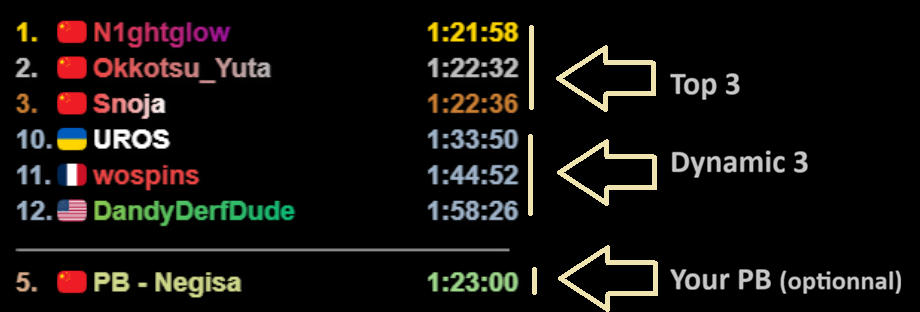
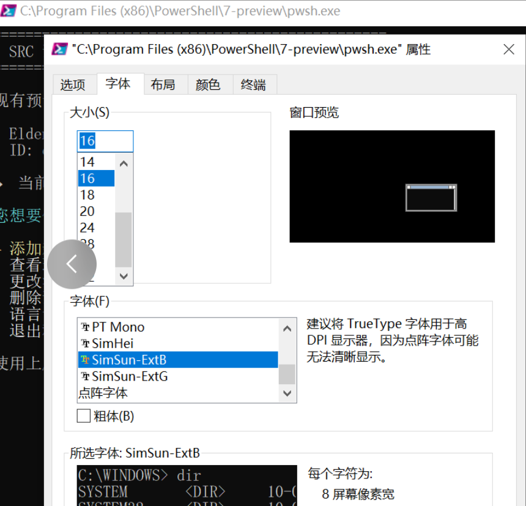

# Speedrun Leaderboard Overlay

**Version 1.40** - Overlay-based speedrun.com leaderboard display  
**Multilingual preset manager with intelligent automation**  
**Supports 5 languages**: Français, English, Español, Português, 中文

Dynamic and animated display of Speedrun.com leaderboards with advanced features for streamers and speedrunners.



---

## Features

### Advanced customization
- Visual tweaks menu in the PowerShell preset manager to customize layout, fonts, spacing, effects, flags/trophies and carousel.
- Custom font selection for the overlay via `defaults.fontStyle` (Arial, Verdana, Times, etc.).
- Configurable rank alignment (left/center/right) and rank prefix style (dot vs hash) via `defaults.rankAlign` and `defaults.rankPrefixMode`.
- Smarter player name rendering with `defaults.maxNameWidthVisible`, marquee scrolling for long names, and spacing that respects the time column.
- Enhanced temporary PB handling: your PB can appear even if your account is not on the loaded leaderboard, using `playerName` and `playerCountry`.
- New PB highlight: personal bests submitted in the last 5 days are rainbow-colored on the board, with configurable `defaults.rainbowIntensity`.
- Configurable separator bar width between the main table and the personal row via `defaults.pbSeparatorWidth`.
- Optional time format `1h25m25s225ms` in addition to `1:25:25.255` via `defaults.timeFormat`.
- Safe reset option in the PowerShell script to restore `config.json` to default values if your configuration is broken.
- Full review and correction of all 5 language packs (FR/EN/ES/PT/ZH), including the new parameters/visuals menu texts.
- Improved flag rendering: consistent spacing, fallback globe icon when no flag is available, and per-country overrides via `flagOverrides`.

### Personal Best Tracking
- **Enhanced Temporary PB**: Show your run even when you're not on the loaded leaderboard (uses `playerName` and `playerCountry`)
- **Rainbow Visual Effects**: Temporary PBs and recent official runs (< 5 days) display with rainbow colors
- **Real-time Updates**: Manually update your temporary PB during runs via the PowerShell menu
- **Smart Display**: Appears on a dedicated row at the bottom with your flag and name
- **Easy Management**: Clear or update temp times anytime through the configuration script

### Game Support
- **Full Games & Individual Levels**: Complete support for all game types
- **Multiple Subcategories**: Handle complex category structures (Levels, Any%, etc.)
- **Millisecond Precision**: Full support for games requiring millisecond timing (Celeste, etc.)
- **Smart Time Parsing**: Accepts formats like `1:22.123` or `82.5` seconds

### Multilingual Interface
- **5 Complete Languages**: French, English, Spanish, Portuguese, Chinese
- **Real-time Switching**: Change language without restart
- **Persistent Settings**: Language automatically saved in configuration
- **Global Accessibility**: Designed for the international speedrun community

### Display Features
- **Overlay Rendering**: Smooth, high-quality graphics with canvas-based rendering
- **Animated Carousel**: Rotating display of additional leaderboard entries with fade transitions
- **Country Flags**: Automatic flag display from flagcdn.com with per-country override support
- **Ranking Colors**: Gold/Silver/Bronze for top 3, blue-grey for others
- **Recent PB Highlighting**: Rainbow effect for runs submitted in the last 5 days
- **Tie Handling**: Same time = same rank
- **Trophy Icons (Optional)**: Show 1st/2nd/3rd trophy icons instead of rank numbers
- **Configurable Fonts**: Choose from 10 font families (Arial, Verdana, Times, etc.)
- **Smart Name Display**: Marquee scrolling for long names with configurable width limits
- **Flexible Rank Appearance**: Left/center/right alignment with dot (#) or hash (№) prefix
- **Responsive Layout**: Adapts to different display sizes with configurable dimensions

### Intelligent Automation
- **Player Validation**: Automatic verification against speedrun.com API
- **Auto-preset Activation**: When only one preset remains, automatically activates it
- **Smart Configuration**: JSON-based settings with sensible defaults
- **Error Handling**: Comprehensive error messages and recovery

---

## Installation (5 minutes)

### Prerequisites

**PowerShell 7 Required** (Windows 10/11 - handles UTF-8 encoding correctly)

1. **Install PowerShell 7**  
   Download from: https://github.com/PowerShell/PowerShell/releases/
   - Choose latest stable release (green label)
   - Download `.msi` installer for your system (x64/x86)

2. **File Association**  
   - Right-click `configure.ps1` → "Open with" → "Choose another app"
   - Check "Always use this app to open .ps1 files"
   - Select "PowerShell 7"

3. **Fix Execution Policy**
   
   **Quick Fix**: Double-click `FIX_ACCESS.bat` - fixes everything automatically
   
   **Manual method**:
   ```powershell
   Set-ExecutionPolicy -Scope CurrentUser -ExecutionPolicy RemoteSigned
   Unblock-File -Path .\configure.ps1
   ```

4. **For Chinese language support** (if experiencing Chinese character display issues):
   - Right-click the PowerShell window title bar
   - Select "Properties" → "Font" tab
   - Change font to a Chinese-compatible font (e.g., SimSun, SimHei, or Microsoft YaHei)
   - Click "OK"
   
   

### Quick Setup

Follow the [QUICK_START_EN.md](QUICK_START_EN.md) guide for step-by-step instructions to get your leaderboard in OBS within 5 minutes.

---

## Usage Guide

### Initial Setup
1. Run `configure.ps1`
2. Add your first preset
3. Search for your game and select category
4. (Optional) Set your player name and country - enables enhanced temporary PB feature
5. (Optional) Customize visual settings via "Set Visual Tweaks" menu
6. (Optional) Change language anytime

### Managing Presets
- **Create**: Add new presets for different games/categories
- **Switch**: Change active preset anytime
- **Edit**: Rename presets from details view
- **Delete**: Remove unused presets (auto-activates last remaining)
- **Visual Indicator**: Green dot shows active preset

### Temporary PB System
1. Set your `playerName` and `playerCountry` in the configuration (enables enhanced display)
2. Access "My Temporary PB" menu
3. Enter your current attempt time (e.g., `1:23.45`)
4. Your PB displays with rainbow effects, even if you're not on the leaderboard
5. Clear when run is complete or submit a new time

### OBS Integration
- **Browser Source**: Local File → `leaderboard.html`
- **Dimensions**: Configure in `config.json` (defaults: 700px × 300px)
- **Refresh**: Not needed - updates automatically

---

## Configuration

### Basic Settings
Edit `config.json` for customization:

```json
{
  "defaults": {
    "topCount": 3,                          // Number of top positions always shown
    "timeFormat": "1:25:25.255",            // Time format: standard or "1h25m25s255ms"
    "rankAlign": "center",                  // Rank alignment: "left", "center", or "right"
    "rankPrefixMode": "dot",                // Rank prefix: "dot" (#) or "hash" (№)
    "nameSpacing": 4,                       // Spacing between flag and player name
    "pbSeparatorWidth": 320,                // Width of the PB separator line
    "rainbowIntensity": 90,                 // Rainbow effect intensity for recent PBs (0-100)
    "CAROUSEL_DISPLAY_DURATION": 1000,      // Display duration per carousel entry (ms)
    "useTrophyIcons": true,                 // Use trophy icons for top 3 positions
    "displayHeight": "300px",               // OBS Browser Source height
    "canvasHeight": 300,                    // Internal canvas resolution height
    "carouselInterval": 6000,               // Total carousel rotation cycle (ms)
    "displayWidth": "700px",                // OBS Browser Source width
    "canvasWidth": 300,                     // Internal canvas resolution width
    "runsPerBatch": 4,                      // Carousel entries per rotation
    "maxRuns": 200,                         // Max runs fetched for carousel
    "fontStyle": "Arial",                   // Font family for all text
    "maxNameWidthVisible": 18               // Max visible name width (characters) before marquee
  }
}
```

### Flag Overrides
Override country flags for specific players using ISO 3166-1 alpha-2 codes

**Format**: The left side is the original country code (what players have), the right side is the flag to display instead.

```json
{
  "flagOverrides": {
    "HR": "FR"               // Players from HR (Croatia) will display FR (France) flag
  }
}
```

### Display Customization
- **Overlay Dimensions**: Adjust `canvasWidth`/`canvasHeight` for internal resolution
- **OBS Dimensions**: Modify `displayWidth`/`displayHeight` for browser source
- **Name Display**: Change `maxNameWidthVisible` for name width before marquee scrolling
- **Font Style**: Set `fontStyle` to choose from 10 available font families
- **Rank Appearance**: Configure `rankAlign` (left/center/right) and `rankPrefixMode` (dot/hash)
- **Carousel Speed**: Adjust `carouselInterval` for total rotation cycle
- **Carousel Display**: Set `CAROUSEL_DISPLAY_DURATION` for per-entry duration
- **Batch Size**: Modify `runsPerBatch` for entries per carousel page
- **Visual Effects**: Adjust `rainbowIntensity` for recent PB highlighting (0-100)

### Color Scheme
- **1st Place**: Gold (#FFD700)
- **2nd Place**: Silver (#C0C0C0)  
- **3rd Place**: Bronze (#CD7F32)
- **Other Positions**: Blue-grey (#9FB4CA)
- **Temporary PB**: Animated rainbow colors

---

## Advanced Features

### Game Types Supported
- **Full Game Categories**: Any%, 100%, All Bosses, Low%, etc.
- **Individual Level Runs**: Celeste chapters, Mario stages, etc.
- **Complex Subcategories**: Multiple variable filters
- **Mixed Formats**: Supports both timed categories and score-based

### Time Format Support
**Display Formats** (configurable via `defaults.timeFormat`):
- **Standard**: `1:25:25.255` (hours:minutes:seconds.milliseconds)
- **Alternative**: `1h25m25s255ms` (with unit labels)

**Input Formats** (for temporary PB entry):
- **Standard**: `1:23:45` (hours:minutes:seconds)
- **Short**: `1:23` (minutes:seconds)
- **Decimal**: `82.5` (seconds with decimals)
- **Millisecond**: `1:22.123` (with millisecond precision)

### Player Features
- **Enhanced Temporary PB**: Shows your run even when you're not on the loaded leaderboard (uses `playerName` and `playerCountry`)
- **Recent PB Highlighting**: Runs submitted in the last 5 days get rainbow-colored highlighting
- **Position Display**: Shows your official rank at the bottom on a separate row when outside top positions
- **Smart Name Rendering**: Marquee scrolling for long names with configurable width limits
- **Country Detection**: Automatic flag display with override support
- **Player Validation**: Verifies usernames against speedrun.com API

---

## Troubleshooting

### Common Issues

**Script won't execute**  
Solution: Run `FIX_ACCESS.bat` or manually set execution policy

**Game not found**  
Solution: Verify game exists on speedrun.com, check spelling, try alternate names

**Missing categories**  
Solution: Some games have complex structures, verify category exists on website

**Flags not loading**  
Solution: Requires internet connection, flags load from flagcdn.com

**Temporary PB not showing**  
Solution: Ensure `playerName` and `playerCountry` are set in config.json for enhanced temporary PB display

**Carousel not working**  
Solution: Check if enough entries exist beyond the `topCount` setting (e.g., if topCount=3, need 4+ runs total)

### Error Messages

**"Player not found in category"**  
Your username doesn't appear in the selected category leaderboard

**"Category not found"**  
The category doesn't exist or has been renamed on speedrun.com

**"Invalid time format"**  
Use formats like `1:23.45` or `82.5` for time entry

---

## File Structure

```
leaderboard/
├── configure.ps1          # Main configuration script (multilingual)
├── leaderboard.html       # Overlay display (for OBS)
├── config.json           # Settings and presets storage
├── FIX_ACCESS.bat        # Execution policy fixer
├── README.md             # Complete documentation
├── QUICK_START_*.md      # Language-specific quick guides
└── images/              # Documentation assets
```

---

## Technical Details

### API Integration
- **Speedrun.com API v1**: Full integration with official REST API
- **Real-time Data**: Live leaderboard updates
- **Player Validation**: Username verification against API database
- **Category Resolution**: Automatic mapping of categories and subcategories

### Canvas Rendering
- **High DPI Support**: Device pixel ratio awareness for crisp display
- **Smooth Animations**: 60fps carousel transitions with fade effects
- **Efficient Drawing**: Optimized render loops for performance
- **Responsive Design**: Adapts to different overlay resolutions

### Data Management
- **JSON Configuration**: Human-readable settings format
- **Preset System**: Multiple game/category configurations
- **Persistent Storage**: Settings saved automatically
- **Validation Layer**: Input verification and error handling

---

## How it works

The **"config.json"** file contains **presets** for different games/categories:

```json
{
  "playerName": "Xeill",
  "playerCountry": "US",
  "activePreset": "elde-any-glitchless",
  "language": "en",
  "presets": {
    "elde-any-glitchless": {
      "name": "Elden Ring - Any% Glitchless",
      "gameId": "nd28z0ed",
      "category": "Any%",
      "subcategory": "Glitchless",
      "subcategories": {
        "variableId": "7891zr5n",
        "valueId": "qj740p3q",
        "label": "Glitchless"
      }
    },
    "celeste-resort": {
      "name": "Celeste - Celestial Resort",
      "gameId": "o1y9j9v6",
      "levelId": "r9g4k7p9",
      "levelName": "Celestial Resort",
      "category": "Any%",
      "subcategory": ""
    }
  },
  "temporaryRun": {
    "active": true,
    "time": "55:05"
  },
  "defaults": { /* visual settings */ },
  "flagOverrides": { /* country code mappings */ }
}
```

The overlay automatically uses the `activePreset` from the configuration.

## Adding a Game

**Recommended method**: Use the configure.ps1 script!

1. **Double-click** on configure.ps1
2. **Choose language** if needed (via "Change Language" menu option)
3. **Select** "Add new preset"
4. **Follow** the automatic wizard

Everything is handled automatically, including preset activation!

**Documentation available in your language:**
- Choose your QUICK_START guide according to your preferred language
- The script interface automatically adapts to your choice

See **[QUICK_START_EN.md](QUICK_START_EN.md)** for detailed tutorial with screenshots.

## Complete Guides

### Multilingual Documentation
- **French: How to add a game?** → [QUICK_START_FR.md](QUICK_START_FR.md)
- **English: How to add a game?** → [QUICK_START_EN.md](QUICK_START_EN.md)
- **Spanish: How to add a game?** → [QUICK_START_ES.md](QUICK_START_ES.md)
- **Portuguese: How to add a game?** → [QUICK_START_PT.md](QUICK_START_PT.md)
- **Chinese: How to add a game?** → [QUICK_START_ZH.md](QUICK_START_ZH.md)

### Configuration
- **Visual customization** → Use "Set Visual Tweaks" menu in configure.ps1
- **Multilingual interface** → "Change Language" menu option
- **Advanced settings** → Edit defaults in config.json (see Basic Settings section)
- **Runs fetched** → defaults.maxRuns (default: 200)

## Customizing Appearance

**Recommended method**: Use the **Visual Tweaks** menu in `configure.ps1`!

1. **Run** configure.ps1
2. **Select** "Set Visual Tweaks" from the menu
3. **Configure** layout, fonts, spacing, effects, flags/trophies, and carousel settings
4. **Changes** are saved automatically to `config.json`

**Advanced method**: Edit the `DRAW` constants section in `leaderboard.html` directly for fine-tuned control over colors, spacing, and positioning.

## Help

**Script won't run when double-clicking?**  
→ **Use `FIX_ACCESS.bat`** - it fixes security policies automatically!  
→ Or make sure you installed **PowerShell 7** and associated `.ps1` files with it (see Prerequisites above)

**Get "running scripts is disabled" error?**  
→ **Double-click `FIX_ACCESS.bat`** to fix execution policy  
→ Or manually run: `Set-ExecutionPolicy -Scope CurrentUser -ExecutionPolicy RemoteSigned`

**If it still doesn't work:**
- Try: Right-click `configure.ps1` → "Run with PowerShell 7"
- Or: Open PowerShell 7 directly and run: `cd <folder>; .\configure.ps1`

**The carousel doesn't scroll?**  
→ Check that there are more runs than the `topCount` setting (default: 3)

**No runs appear?**  
→ Verify the gameId, category, and subcategory (case sensitive!)

**"Failed to fetch" when double-clicking the HTML?**  
→ Normal! Only works with OBS integration.
